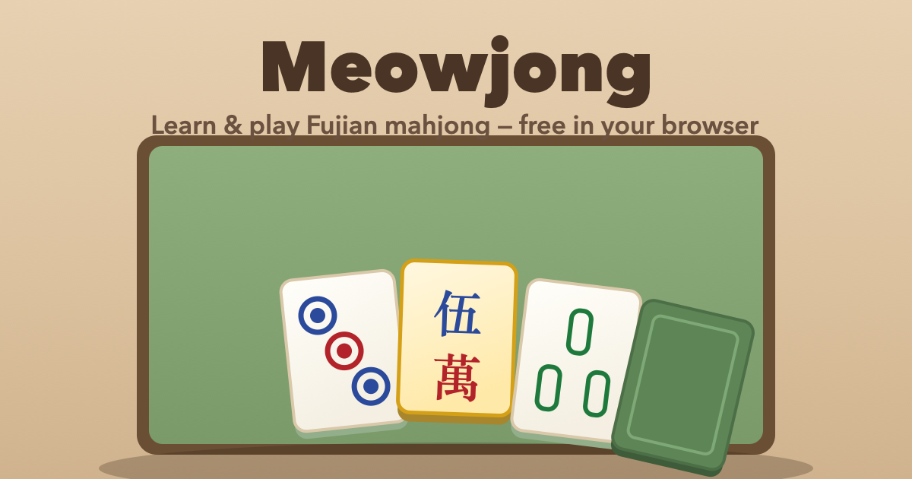

# 🀄 Meowjong — Learn & Play FJ (Fujian) Mahjong

**▶ Play now: https://coutlike.github.io/meowjong/** — free, no install, right in your browser.

A beginner-friendly implementation of **FJ (Fujian/Fuzhou) style 4-player mahjong** — the
fast, gold-rush variant — with a 3D table, café-cat opponents, a built-in teacher
(**Professor Paws** 🎓), synthesized sound, and an online **party mode** for playing
with friends. This is the only variant implemented.

## Highlights

- **A real table, not a webpage** — perspective-tilted felt, tiles with physical thickness,
  a depleting wall, tile flights and claim slams, an animated win ceremony, and expressive
  cats. All effects are optional (Full motion / Subtle / Off) and respect `prefers-reduced-motion`.
- **Learns you into the game** — an interactive tutorial, a Strategy School, and a coach
  whose advice runs on exact efficiency math (shanten + tile acceptance).
- **Accessible** — fully keyboard-playable hand, labelled tiles, live-region narration.
- **Zero build, zero server** — plain HTML/CSS/JS; sound is synthesized (no audio files);
  the only dependencies are PeerJS (party mode) and Three.js (the 3D table below) —
  both vendored locally, so the game still opens straight from `file://` offline.

## How to run locally

Open `index.html` in any modern browser (double-click it). No install, no build.
Party mode needs an internet connection (it uses the free PeerJS peer-to-peer service).

Tests: `node tests/run.js` (or `npm test`).

## FJ rules implemented

- **124 tiles**: Dots ● / Bamboo ∥ / Characters 萬 (1–9 ×4) + four winds. **No dragons.**
- **Winds are flowers 🌸**: drawn (or dealt) → exposed beside the hand → replacement drawn
  from the back of the wall. They never stay in a hand.
- **The Gold 🥇 (金)**: after the deal, a tile is flipped at the back wall; its 3 remaining
  copies are **wild** — each substitutes any suit tile in a set. A gold can **not** be the
  pair/eyes and can **not** be used in chi/peng/gang claims.
- **Winning hand**: 4 sets + 1 pair (13-tile hands; dealer draws first).
- **Instant wins**: **三金倒** — hold all three golds (+30); **抢金 Robbing the Gold** — the
  flipped gold completes a ready dealt hand (+50).
- **Scoring**: winner gets **10 base × flower count** (min ×1); **+20** for winning with no
  flowers (无花); **+10** self-draw. The player who discards the winning tile pays double;
  on self-draws and instant wins everyone pays.
- Chi only from the previous player; peng/gang from anyone; concealed/added gangs with
  back-wall replacement draws.

## First-person 3D table 🀄

Sit AT the table — this is the default view: a real seated perspective with
competition-size tiles, board-game lighting, and a real felt-and-wood table
you lean into. Drag a tile from your rack into the river to discard; every
claim/kong/win prompt, Professor Paws, and the coach's analysis are the same
panels as the classic board, just floating over the scene. Same rules, same
AI, same save — this is a presentation-and-input layer over the identical
game, not a separate mode with its own logic. Prefer the flat top-down
board? Turn ⚙ Options → **3D table** off.

- **Desktop + mouse only, by design.** It's on by default but disables
  itself (and falls back live if you resize below the threshold) on a
  narrow or touch-primary screen — the classic board is the tested,
  always-available, fully keyboard/screen-reader-accessible fallback.
- **Hidden information stays hidden.** Opponents' concealed tiles are never
  sent to the renderer as anything but a count; the camera is limited to a
  realistic seated range that a scripted sweep across its entire reachable
  envelope confirms can never face a hidden tile. See `docs/FIRSTPERSON_3D_PLAN.md`
  for the full verification trail.
- Respects the same Full motion / Subtle / Off effects setting and
  `prefers-reduced-motion` as the classic board — camera moves and tile
  placements go instant, nothing keeps animating, when motion is reduced.

## Party mode 🎉

Real 4-player mahjong over the internet, no server to set up: host gets a 4-letter room
code, up to 3 friends join with it, AI cats fill empty seats and take over on disconnect.
Everyone sees the table from their own seat (flower rows and the gold are public).

> Multiplayer is peer-to-peer over STUN, which connects players directly across most
> networks (including cellular ↔ home Wi-Fi). It ships **relay-free** — a small minority
> of pairs where *both* sides are behind a strict/symmetric NAT (some VPN, corporate, or
> hotel Wi-Fi) can't be traversed directly and won't connect out of the box. If a join
> fails, use **🎉 Party → 🧪 Test my connection** to see which layer is the problem;
> putting one player on a phone hotspot usually works. To add a relay for those hard-NAT
> pairs, drop free Metered credentials into `METERED_TURN` (or point `PARTY_TURN_SERVERS`
> at your own TURN server) in `js/net.js`.
> [Reports welcome](https://github.com/coutLiKe/meowjong/issues).

## Learning features

- **🎓 Interactive tutorial** — 16 lessons with quizzes, FJ rules from zero (auto-opens first visit)
- **🧠 Strategy School** — 6 advanced lessons: steps-to-ready, wait shapes, counting live
  tiles, gold strategy, flower economics (bet sizing), claim discipline
- **🎓 Professor Paws** — one friendly coach, one brain. He auto-comments as you play
  (distance to ready, gold/flower alerts, tenpai/danger warnings) and his **💡 Hint** button
  suggests the discard to make — with live-tile counts, safety reads, and gold warnings.
- **📊 Show my full analysis** — an expander inside Paws' panel that reveals the *same*
  engine's full working: **every** legal action ranked by exact shanten and **ukeire**
  (tile acceptance), each opponent modelled (speed × flower payout × suit reads), and
  Monte Carlo rollouts refining the deal-in risk. Because Paws' Hint and the ranked table
  read one engine, they never disagree. Design doc: `docs/STRATEGY_ASSISTANT.md`
- **🏆 Winning-path view** — every win is shown grouped into its four sets + pair, so you
  see *why* the hand wins
- **🔤 Labels toggle** — corner numbers/letters on tiles while you learn to read the faces
  (classic board only)
- **📜 Game log** — every action narrated in plain English

## Feedback

Found a bug, or party mode wouldn't connect? Please
[open an issue](https://github.com/coutLiKe/meowjong/issues) — it genuinely helps.

## License

[MIT](LICENSE) © 2026 Kevin Lin
